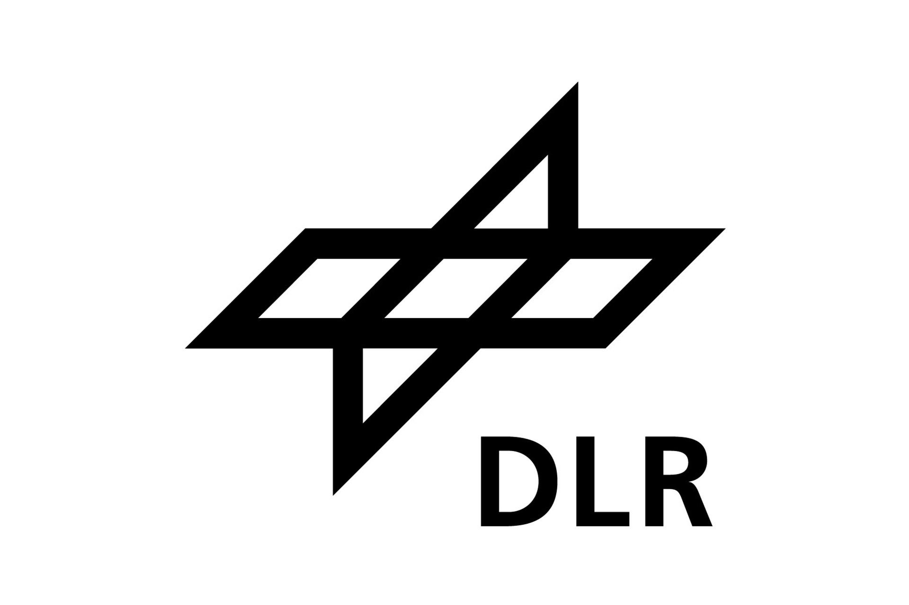
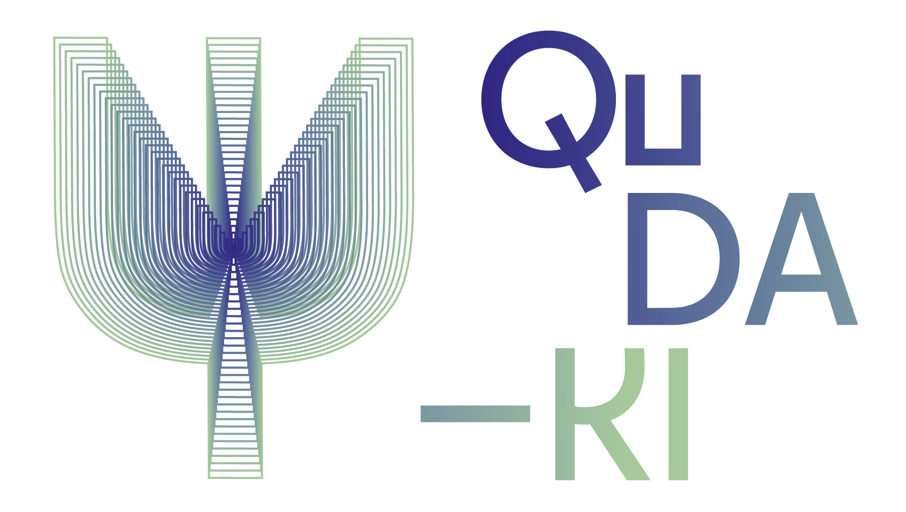

# Learning capability of parametrized quantum circuits

This repository contains code to determine the learning capability
of circuit architectures or ansaetze.
It can, thus, be used to reproduce single learning capability values which are depicted in figures of the paper [[1]](https://arxiv.org/abs/2209.10345).

## Installation
Install the dependencies via
```
pip install --upgrade pip
pip install -r requirements.txt
ipython kernel install --user --name=learning_cap
```
Now you can use you jupyter notebook setup and select the `learning_cap` kernel.

## Usage
The notebook `learning_capability.ipynb` allows to define circuit architectures and to determine their learning capability.

The notebook `create_rnd_functions.ipynb` enables to create, load and analyse the cross-correlation of truncated Fourier series for a given degree (as described in App. C).

## License
Licensed under the BSD 3-clause license, see `LICENSE` for details.

## Contact persons
In case of any questions, please contact:\
Dirk Heimann  dirk.heimann@uni-bremen.de or\
Gunnar Schönhoff gunnar.schoenhoff@dfki.de

## Acknowledgments

This work was funded by the German Federal Ministry of Education and Research (BMBF) through the project Q$^3$-UP! under project number 40301121 (University of Bremen) and project number 13N15779 (DFKI) administered by the technology center of the Association of German Engineers (VDI) and by the German Federal Ministry of Economics and Climate Protection (BMWK) through the project QuDA-KI under the project numbers 50RA2206A (DFKI) and 50RA2206B (University of Bremen) administered by the German Aerospace Center (DLR).

## References
* [1] Heimann, D., Schönhoff, G., & Kirchner, F. (2022). *Learning capability of parametrized quantum circuits*. arXiv preprint [arXiv:2209.10345](https://arxiv.org/abs/2209.10345).

<a href="https://www.uni-bremen.de/en/"></a>
<a href="https://robotik.dfki-bremen.de/en/"></a>
<a href="https://www.bmbf.de/"></a>
<a href="https://www.vditz.de/"></a>
<a href="https://robotik.dfki-bremen.de/de/forschung/projekte/q3up/"></a>
<a href="https://www.bmwk.de/"></a>
<a href="https://www.dlr.de/"></a>
<a href="https://robotik.dfki-bremen.de/de/forschung/projekte/quda-ki/"></a>
